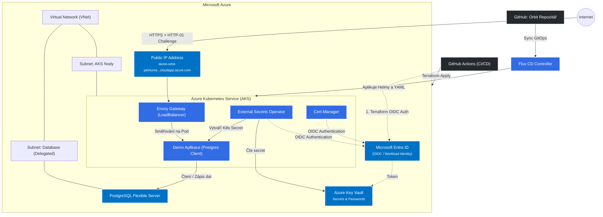

# Orbit: GitOps & Azure Native Infrastructure Demo

Vítejte v repozitáři **Orbit**. Tento projekt slouží jako komplexní ukázka moderního přístupu ke správě cloudové nativní infrastruktury a nasazování aplikací pomocí principů **GitOps** na platformě **Microsoft Azure**. 

Repozitář obsahuje kompletní kód pro nasazení plně funkčního Kubernetes prostředí (AKS) provázaného s řízenými službami (PaaS) v Azure a automatizovaného nasazení ukázkové aplikace prostřednictvím nástroje Flux.

Součástí projektu je také soubor `presentation.md`, který obsahuje prezentaci na téma Azure Landing Zone a Infrastructure as Code. Prezentace je formátována s využitím rozšíření Marp pro snadnou prohlídku a export.

## Architektura a technologie

Pro návrh a zprovoznění bezpečné a škálovatelné infrastruktury využíváme následující technologie a best practices:

*   **Infrastruktura jako Kód (IaC):** Terraform pro nasazení AKS, Azure Key Vault, PostgreSQL Flexible Server a souvisejících síťových komponent (VNet, Subnety, NSG).
*   **GitOps (Continuous Delivery):** Flux v2 zajišťuje kontinuální synchronizaci deklarativního stavu manifestů v tomto repozitáři s reálným stavem v Kubernetes clusteru.
*   **Moderní Kubernetes Gateway API:** Nativní implementace Kubernetes Gateway API prostřednictvím **Envoy Gateway**. Ingress vrstva je navázána přímo na statickou Azure Public IP adresu s automaticky generovaným plně kvalifikovaným doménovým jménem (FQDN) na doméně `cloudapp.azure.com`.
*   **Secret Management:** External Secrets Operator (ESO) integrovaný s Azure Key Vault. Tajné údaje a pověření jsou aplikacím bezpečně distribuovány za běhu bez ukládání v prostém textu.
*   **Správa identit prostřednictvím OIDC:** Koncept Azure Workload Identity napříč celým clusterem. GitHub Actions i nativní Kubernetes moduly (ESO, Cert-Manager) tak získávají dočasná oprávnění skrze Federated Credentials.
*   **Cert-Manager & Let's Encrypt:** Automatizovaná správa TLS certifikátů pomocí HTTP-01 challenge s využitím brány Envoy Gateway.

### Architektonický model

Následující diagram znázorňuje základní komponenty infrastruktury a jejich vzájemnou komunikaci:

## Struktura repozitáře

*   **`.github/workflows/`**: Definuje GitHub Actions pipeline pro nasazování Terraform kódu, bezpečné odstraňování infrastruktury (Terraform Destroy) a operace ovlivňující běhový stav prostředí (uspání a probuzení AKS clusteru a databáze PostgreSQL).
*   **`cluster/`**: Kořenový adresář pro konfiguraci principů GitOps.
    *   **`apps/`**: Definice koncových aplikací (včetně naší *Demo App*, která bezpečně komunikuje s databází a získává heslo z Key Vaultu).
    *   **`infra/`**: Sdílené infrastrukturní prvky clusteru nezbytné pro síť a bezpečnost (Envoy Gateway, Cert-Manager, External-Secrets).
*   **`terraform/`**: Zdrojové kódy definice infrastruktury, strukturované do logických celků:
    * **`01-init`**: Vytvoření Azure Storage Accountu jakožto zabezpečeného úložiště stavových `*.tfstate` bloků a konfigurace federovaných identit pre GitHub Actions (OIDC).
    * **`02-hands-on`**: Vytvoření hlavní výpočetní a datové platformy. Alokace síťových zdrojů (VNet), nasazení AKS clusteru, Key Vaultu a Postgres databáze včetně příslušných oprávnění.
    * **`03-bootstrap`**: Zavedení Flux kontroleru do spuštěného AKS a propojení Terraformu s deklarativním prostředím Kubernetes. Od tohoto okamžiku přebírá řízení aplikace GitOps.
*   **`presentation.md`**: Obsahuje osnovu a prezentační část na téma Landing Zones a IaC (pro správný náhled obsahu je vyžadováno rozšíření Marp pro Visual Studio Code).

## Postup nasazení

Pro zprovoznění celé infrastruktury z vašeho prostředí postupujte následovně:

1. Proveďte naklonování tohoto repozitáře na vaši lokální stanici.
2. Ve složce konfiguračních parametrů repozitáře doplňte vlastní GitHub Personal Access Token (PAT) prostřednictvím souboru `terraform/01-init/secrets.auto.tfvars`. 
3. Přejděte do složky `01-init` a proveďte inicializaci providerů a aplikaci zdrojů spuštěním `terraform init` a `terraform apply`. Po dokončení procesu zmigrujte váš lokální Terraform stav na nově vytvořený backend v cloudu pomocí příkazu `terraform init -migrate-state`.
4. Prostřednictvím GitHub Actions ručně spusťte workflow s názvem `02 - Deploy 02-hands-on` pro nasazení samotné infrastruktury a AKS clusteru.
5. Obdobným způsobem následně spusťte workflow s názvem `03 - Deploy 03-bootstrap`, díky čemuž se do Kubernetes clusteru zavede Flux kontroler.
6. Hotovo. Kontroler si z tohoto repozitáře v návaznosti začne postupně a automaticky stahovat platformní manifesty a nasadí vaši ukázkovou aplikaci plně kvalifikovaně přímo pod přiděleným doménovým jménem. S nasazenými architekturami nadále operujte už jen skrz aktualizace do tohoto Git repozitáře.