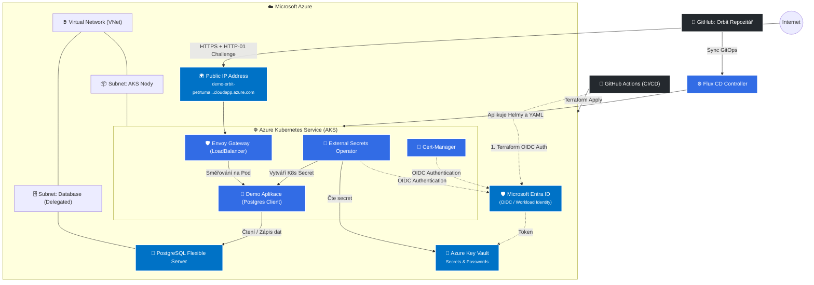

# 🚀 Orbit: GitOps & Azure Native Infrastructure Demo

Vítejte v repozitáři **Orbit**! Tento projekt slouží jako komplexní ukázka moderního přístupu ke správě cloudové nativní infrastruktury a nasazování aplikací pomocí **GitOps** na platformě **Microsoft Azure**. 

Repozitář obsahuje kompletní kód k nasazení plně funkčního Kubernetes prostředí (AKS) provázaného s řízenými službami (PaaS) v Azure a automatického nasazení ukázkové aplikace přes Flux Controller.

## 🏗️ Architektura a technologie

Pro zprovoznění bezpečné, škálovatelné a moderní infrastruktury se opíráme o best practices:

*   **Infrastruktura jako Kód (IaC):** Terraform pro vytvoření AKS, Azure Key Vault, PostgreSQL Flexible Server a souvisejících sítí (VNet, Subnety, NSG).
*   **GitOps (Continuous Delivery):** Flux v2 se stará o to, že stav v Kubernetes clusteru neustále odpovídá deklarativnímu stavu v tomto repozitáři.
*   **Moderní Ingress:** Nativní Kubernetes Gateway API s **Envoy Proxy** jako Ingress Controllerem. Navázáno přímo na statickou Azure Public IP s automaticky generovanou doménou (FQDN) na `cloudapp.azure.com`.
*   **Secret Management:** External Secrets Operator (ESO) integrovaný s Azure Key Vault. Žádná zdlouhavá práce s klíči, aplikace dostávají tajné údaje dynamicky přiběhu.
*   **Identita přes OIDC:** Azure Workload Identity nahrazuje zastaralé Service Principals a Managed Identities napříč celým clusterem. GitHub Actions a moduly v clusteru (ESO, Cert-Manager) získávají dočasná oprávnění skrze důvěru (Federated Credentials).
*   **Cert-Manager & Let's Encrypt:** Automatická správa HTTPS certifikátů pomocí HTTP-01 challenge na Public IP bráně Envoy.

### 🗺️ Architektonický nákres

Zde je schématický pohled na hlavní komponenty a jejich vzájemnou komunikaci:

## 📂 Struktura repozitáře

*   **`.github/workflows/`**: Obsahuje definice GitHub Actions pipelines pro postupné spouštění Terraform kódů a záchranu / stornování prostředí (Uspání, Zničení).
*   **`cluster/`**: Srdce vašeho GitOps!
    *   **`apps/`**: Nasazení koncových aplikací (naše *Demo App* komunikující s databází a získávající heslo přímo z KeyVaultu).
    *   **`infra/`**: Komponenty vázané na infrastrukturu clusteru (Envoy, Cert-Manager, External-Secrets).
*   **`terraform/`**: Infrastructure as Code část, rozdělena do logických bloků:
    * **`01-init`**: Tvorba Azure Storage Accountu pro ukládání stavových `*.tfstate` bloků samotného Terraformu a federovaných identit pre GitHub Actions (OIDC).
    * **`02-hands-on`**: Hlavní platforma. Vytvoření AKS clusteru, Key Vaultu, VNetu a Postgresu na pozadí, včetně Workload Idenities pro komponenty.
    * **`03-bootstrap`**: Zavedení Flux kontroleru do AKS a propojení Terraformu s Kubernetes prostředím (krok, kdy GitOps přebírá řízení).

## 🚀 Jak začít

1. Celý repozitář naklonujte k sobě.
2. Vytvořte nezbytný GitHub token v `terraform/01-init/secrets.auto.tfvars`. 
3. Postupně spusťte `terraform init` a `terraform apply` na složce `01-init`. Následně state zmigrujte.
4. Spusťte z GitHub Actions workflow pro *2. krok Hands-on*.
5. Spusťte workflow pro *3. krok Bootstrap*. 
6. Hotovo! Otevřete doménu vaší aplikace. Všechny změny manifestů se nyní propisují automaticky přes GitOps z repozitáře. Můžete hrát.